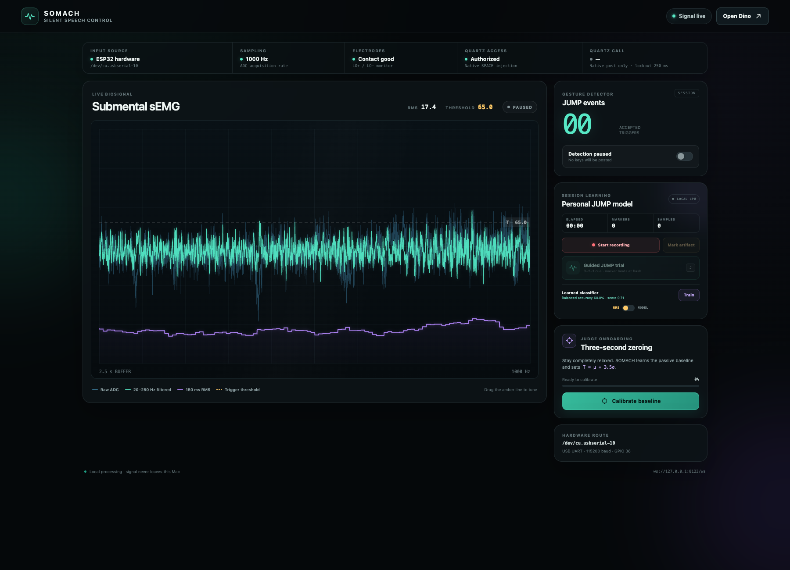

# SOMACH: subvocalized JUMP -> Chrome Dino

SOMACH turns one submental muscle signal into a native macOS `SPACE` event. A
judge silently articulates **JUMP**, an AD8232 and ESP32 stream the resulting
sEMG over USB, and Chrome Dino jumps. Signal acquisition, filtering, threshold
detection, telemetry, and key injection all run locally on the Mac.

Target machine: **16-inch MacBook Pro, Apple M5 Max, 18-core CPU, 40-core GPU,
48 GB unified memory, 2 TB SSD**.

```text
chin electrodes -> AD8232 -> GPIO 36 -> ESP32 @ 1 kHz
                                      |
                                      v USB UART, 115200
React dashboard <- WebSocket <- FastAPI + causal DSP -> Quartz SPACE -> Dino
localhost:3000                  localhost:8123
```

## What is implemented

- Exact single-channel ESP32 firmware with 1,000 Hz deadline scheduling,
  lead-off status, clipping counters, and sample-loss telemetry.
- Stateful causal DSP: 60 Hz notch (`Q=30`), fourth-order Butterworth bandpass,
  and a trailing 150 ms RMS envelope evaluated every 20 ms.
- Three-second zeroing: `threshold = resting mean + 3.5 * resting standard
  deviation`, followed by a 250 ms refractory period and hysteretic re-arm.
- Deterministic `--mock` mode and live `--hardware` USB serial mode.
- FastAPI controls, a 50 Hz batched WebSocket, and a 60 FPS React Canvas
  dashboard with raw, filtered, RMS, threshold, lead-off, and jump telemetry.
- Native macOS key events through Quartz `CGEventPost`; no PyAutoGUI delay.
- Local aligned recording, guided JUMP/artifact labels, trial-grouped held-out
  validation, and a reversible learned-model/RMS selector.

This is **silent articulation**, not thought reading. It detects a voluntary,
closed-mouth motor gesture associated with JUMP.

## Verified live-hardware results

These are measurements from Carl's single-channel rig during the July 24, 2026
Night Hack session, not mock-mode estimates:

| Check | Measured result | What it means |
| --- | --- | --- |
| Hardware route | `OUTPUT -> GPIO36`, `SDN -> GPIO27` | Restored the wiring/firmware combination that had worked previously; GPIO34 was a floating input on this physical layout. |
| Acquisition | Stable `1,000 Hz`; `0%` live clipping after the pads were attached | The complete AD8232 -> ESP32 -> USB -> Mac data path worked with usable contact. |
| Three-second rest calibration | RMS `mu = 11.32`, `sigma = 8.73`, automatic `T = 41.88` ADC counts | The baseline calculation worked, but the automatic threshold was too sensitive to ordinary mouth/neck activity. |
| Real data captured | `358,700` clean samples across three sessions (`358.7 s` total) | The recorder saved about six minutes atomically; the labeled session contains 8 JUMP and 12 artifact markers. |
| Hard negatives | Swallow peaks reached `112.95`; three clean JUMP peaks reached `77.42`, `116.57`, and `93.62` RMS | A single amplitude threshold cannot honestly distinguish every JUMP from every swallow or spoken movement. |
| Learned-model check | Held-out balanced accuracy `60%`, recall `50%` | The small one-session model failed the deployment bar, so **MODEL remains off**. |
| Controlled game rehearsal | Exactly `3/3` deliberate silent gestures produced three detector events and three Quartz Space posts | The core demo works when detection is gated to a short, silent command window at the tested RMS threshold of `65`. |

The measured Quartz posting call was roughly `0.05-0.52 ms`. That is only the
native API call overhead, not mouth-to-game latency. Unrestricted swallowing,
talking, coughing, or jaw motion can still false-trigger this one-channel
energy detector. During a demo, keep detection paused for setup and narration,
then arm it only while the wearer is silent and deliberately issuing commands.



*Authentic local hardware capture: 1,000 Hz input, contact good, RMS threshold
65, weak learned model left inactive, and detection paused while documenting.*

## Why the M5 GPU and a TCN are not used tonight

The M5 Max can run MLX, PyTorch MPS, and a temporal convolutional network, but
GPU execution is the wrong optimization for this demo:

- The live input is one channel in 20-sample blocks, not a large tensor.
- This session produced only 8 labeled JUMPs and 12 artifacts from one wearer.
  Its lightweight held-out classifier reached `60%` balanced accuracy and
  `50%` recall, which is evidence that more data are needed, not a reason to
  deploy a larger model.
- Prior capstone models were placement- and session-sensitive; their weights do
  not transfer honestly to this new single-channel judge setup.
- Dispatching tiny operations to a GPU adds synchronization and framework
  overhead. Stateful SciPy/NumPy filtering and an O(1) RMS update are simpler
  and lower-overhead on the CPU.
- The CPU path remains local and works offline after dependencies are installed.

Collect many labeled JUMP, swallow, speech, cough, jaw-motion, and rest windows
across users and replacement sessions first. Validate by held-out person and
session, then compare a small TCN against this threshold baseline. The dashboard
and API already provide the acquisition foundation for that work.

## Safety first

This prototype is not a medical device and USB is not medical isolation.

1. Power down before moving any wire. Never power the AD8232 from `5V`.
2. With electrodes on a person, run the MacBook on its **internal battery**.
   Disconnect its charger, mains-powered monitor, dock, oscilloscope, and every
   other mains- or earth-connected peripheral.
3. Use intact commercial Ag/AgCl electrodes on healthy skin with consent. Stop
   immediately for pain, tingling, heat, or skin irritation. Do not cut the
   conductive gel, metal snap, or center of an electrode.
4. Inspect the board, insulation, USB cable, and electrode cable. Do not use
   damaged, wet, or improvised conductive parts on a person.
5. Electrode cable colors are not standardized. Follow `RA`, `LA`, and `RL` on
   the sensor/cable documentation or verify continuity with a multimeter. On
   Carl's previously tested cable, yellow was `LA`, green was `RA`, and red was
   `RL`; re-check the actual cable before relying on that history. `RA` and
   `LA` are the differential pair; `RL` is the reference.

The colored jumpers in the table below are board wiring and must not be confused
with the three electrode leads.

## Exact current wiring

| AD8232 pin | Jumper | ESP32 destination | Use |
| --- | --- | --- | --- |
| `OUTPUT` / `SIG` | Yellow | GPIO 36 (`ADC1_CH0`, `VP`) | 12-bit sEMG ADC input |
| `3.3V` | Red | `3V3` via red rail | Sensor power |
| `GND` | Black | `GND` via blue rail | Common low-voltage reference |
| `SDN` | Red | GPIO 27 | Firmware drives HIGH to enable the sensor |
| `LO-` | Orange | GPIO 35 | Active-high negative lead-off input |
| `LO+` | Orange | GPIO 32 | Active-high positive lead-off input |

GPIO 36 is the only analog signal. GPIO 35 and GPIO 32 are digital lead-off
inputs, not extra EMG channels. `SDN` is wired to GPIO 27; the firmware must
configure it as an output and drive it HIGH before sampling.

## Install

Prerequisites are Python 3.11, [`uv`](https://docs.astral.sh/uv/), Node.js
20.19 or newer, npm, Chrome, and PlatformIO for firmware flashing.

From the repository root:

```bash
uv sync --python 3.11
npm --prefix frontend ci
```

Install PlatformIO Core if `pio` is unavailable:

```bash
uv tool install --with pip platformio
```

Dependency installation needs internet once. The runtime itself uses no cloud
service; use `chrome://dino` for a fully offline game.

## Fastest demo start

One command installs anything missing and starts both local services:

```bash
./scripts/start-demo.sh --mock
```

For the physical rig after flashing the ESP32:

```bash
./scripts/start-demo.sh --hardware --prompt-accessibility
```

Open the fully offline Chrome game in its own window with:

```bash
./scripts/open-dino.sh
```

Press `Control-C` in the launch terminal to stop the backend and dashboard.
Equivalent shortcuts are `make mock`, `make hardware`, `make probe`, and
`make test`.

## Electrode preparation and placement

Use fresh, intact pads on clean, dry, hair-free skin. Do not place them over
broken or irritated skin.

1. If the pads are physically too wide and their manufacturer permits trimming,
   use clean scissors on the **outer nonconductive foam backing only**. Never
   cut the hydrogel disc, metal snap, conductive trace, or protective center.
2. Keep the two hydrogel centers about `1.5 cm` apart so the pads and gel do not
   touch or bridge.
3. Place differential pad 1 on the submental midline about `3 cm` behind the
   chin tip.
4. Place differential pad 2 on the same midline, `1.5 cm` directly behind pad
   1. Keep both pads aligned with the front-to-back tongue/jaw muscle axis.
5. Place the reference pad over clean skin at the clavicle. Keep its cable away
   from the two signal leads and USB cable.
6. Connect the differential pair to the cable's verified `RA`/`LA` contacts and
   the reference to `RL`; cheap cable colors vary, so verify labels/continuity
   instead of assuming red or black means ground.

Press each pad for several seconds, confirm both lead-off flags are clear, then
perform the three-second baseline. Do not move pads after calibration.

## Flash the ESP32

Keep electrodes off the person while wiring and flashing.

```bash
pio device list
pio run --project-dir firmware
pio run --project-dir firmware --target upload \
  --upload-port /dev/cu.usbserial-XXXXXXXX
```

Replace the port with the device shown by `pio device list`. Common alternatives
are `/dev/cu.usbmodem*`, `/dev/cu.SLAB_USBtoUART`, and
`/dev/cu.wchusbserial-*`. Full firmware details and the `#META` format are in
[`firmware/README.md`](firmware/README.md).

The serial stream is intentionally compact: one decimal ADC value per line at
1,000 Hz, plus one `#META,key=value,...` line per second. Timestamped CSV text
would exceed the comfortable payload budget of 115200-baud UART at 1 kHz.

## Run in mock mode

Use two terminals from the repository root.

Terminal 1:

```bash
uv run python backend/main.py --mock --prompt-accessibility
```

Use `--no-keypress` for a safe waveform-only test.

Terminal 2:

```bash
npm --prefix frontend run dev
```

Open [http://localhost:3000](http://localhost:3000), click **Calibrate
baseline**, remain still for three seconds, then press Space on the dashboard or
click **Trigger impulse**. Mock mode injects a deterministic 180 ms muscle burst
through the same DSP and trigger path as hardware.

To verify mock key injection while Dino remains frontmost, schedule the mock
burst and click the Dino window before the two-second delay expires:

```bash
(sleep 2; curl -s -X POST http://127.0.0.1:8123/api/mock/trigger >/dev/null) &
```

## Run with hardware

Close PlatformIO/Arduino Serial Monitor first; only one process can own the
serial port.

```bash
uv run python backend/main.py --hardware --prompt-accessibility
```

The backend auto-detects common macOS ESP32 device names. Pin it explicitly if
needed:

```bash
uv run python backend/main.py --hardware \
  --serial-port /dev/cu.usbserial-XXXXXXXX \
  --prompt-accessibility
```

Then run the dashboard:

```bash
npm --prefix frontend run dev
```

The serial connection explicitly disables DTR/RTS flow control and line states,
waits two seconds for boot, and clears bootloader text before parsing. This is
the reset-loop fix recovered from the earlier capstone.

## Three-second calibration and Dino focus flow

1. Start the backend and dashboard. Confirm **Signal live**, approximately
   `1000 Hz`, **Contact good**, and **Quartz authorized**.
2. Attach the electrode pair over the target submental area and the reference
   to the chosen bony reference site. Keep placement fixed for the session.
3. Relax the jaw and tongue. Click **Calibrate baseline** and remain completely
   still for the full three seconds. Calibration sets the threshold but leaves
   **Detection paused**; arming always requires a separate deliberate action.
4. The formula is a starting point, not a swallow classifier. If normal mouth
   activity triggers events, drag the amber threshold upward. Carl's tested
   filming value was `65`; a new wearer or pad placement needs retuning.
5. Open `chrome://dino` or use the dashboard's **Open Dino** button. Press Space
   once manually to start the game.
6. Finish every spoken explanation while detection is paused. Say how many
   silent commands are coming, swallow if needed, then turn detection on.
7. Put the dashboard and Dino side by side, but click **Dino last**. Quartz sends
   Space to the frontmost application. If you touch the dashboard, refocus Dino.
8. Stay silent and articulate JUMP with the rehearsed closed-mouth tongue-up/back
   gesture. After the final command, pause detection before speaking again.

### Optional local session learning

Use **Session learning** only after the waveform is clean and not clipping. All
recordings, features, training, and validation stay on this Mac.

1. Click **Start recording** and leave relaxed gaps between trials so the model
   captures real rest/background examples.
2. Run at least six **Guided JUMP trials** (or press `J`). Wait through 3-2-1,
   then subvocalize JUMP on the bright **JUMP NOW** cue. The marker is placed at
   that cue and the backend uses the following 300 ms of signal.
3. Click **Mark artifact** on coughs, pad adjustments, jaw movement, or other
   accidental bursts. Clipped hardware windows and unsafe live markers are
   rejected rather than included silently.
4. After the last trial has finished, click **Stop & save**. The aligned raw,
   filtered, timing, and marker data are written locally as
   `datasets/somach_*.npz` plus matching JSON metadata.
5. Click **Train**. The validation gate requires at least six usable JUMP trial
   groups and six artifact/background groups, keeps entire trials together in
   a deterministic held-out split, and reports held-out balanced accuracy. A
   training error means collect cleaner or longer data; it is not a pass.
6. Only after training succeeds does the **RMS / MODEL** switch become
   available. Review the held-out score before optionally enabling MODEL; leave
   RMS selected if performance is weak or the electrode placement changes.

Model activation is reversible and initially falls back to RMS until its first
300 ms feature window is ready. Re-record and retrain after moving electrodes
or changing users; a one-session score is demo evidence, not generalization.

In the July 24 session, the held-out result was `60%` balanced accuracy with
`50%` JUMP recall, so it did **not** earn activation. The live demo deliberately
uses the simpler RMS detector and shows that choice rather than hiding a weak
model behind the M5 Max GPU.

For the next collection, keep **JUMP** as the positive class, keep passive rest
as background, and preserve hard-negative subtypes such as **swallow**, **spoken
speech**, **cough/throat-clear**, **jaw/tongue motion**, and **pad/cable motion**.
They may all collapse to `not JUMP` for a binary controller, but retaining the
subtype reveals which behavior causes false positives. Tonight's UI stores one
generic `artifact` label, so the 12 negatives are sufficient for a pipeline
check but not for subtype-level claims; do not call every negative merely
"noise."

### Grant Quartz Accessibility access

Start once with `--prompt-accessibility`, then open:

**System Settings -> Privacy & Security -> Accessibility**

Enable the terminal application that launches the backend (Terminal, iTerm, or
the relevant host). Quit and restart that terminal and the backend after changing
permission. The dashboard must show **Authorized**. Grant access only to the
known local terminal/process; macOS treats it as permission to control input.

## Dashboard glossary: what RMS and the labels mean

EMG is an alternating electrical waveform: useful muscle activity swings above
and below its local center. A normal arithmetic mean can therefore look close
to zero even during a strong burst because positive and negative samples cancel.
Root mean square (RMS) turns the recent oscillation into one stable measure of
burst strength:

```text
RMS = sqrt((x1^2 + x2^2 + ... + xN^2) / N)
```

Here `x` is the centered, filtered signal and `N = 150` samples, or `150 ms` at
`1,000 Hz`. Squaring makes both polarities positive, averaging suppresses
sample-to-sample jitter, and the square root returns the result to ADC-count
units. **RMS measures recent muscle-signal energy; it is not a word probability
and does not by itself know whether a burst was JUMP, a swallow, or speech.**

| Dashboard label | Plain-English meaning |
| --- | --- |
| **Input source** | `Hardware` is the real USB rig; `Mock` is deterministic synthetic test data. |
| **Sampling** | Actual ADC samples received per second. The target is about `1,000 Hz`. |
| **Electrodes / LO+ / LO-** | AD8232 digital contact indicators. GPIO32 and GPIO35 report a detached differential lead; they are not extra EMG channels. |
| **Quartz access** | Whether macOS permits the backend to post a native Space key. |
| **Quartz call** | Duration of the most recent native key-posting API call, not full mouth-to-screen latency. A dash means no key has been posted in this run. |
| **Raw ADC** | The ESP32's unsigned 12-bit voltage reading (`0-4095`) before software filtering. |
| **20-250 Hz filtered** | Raw signal centered and passed through the causal 60 Hz notch plus digital bandpass. The physical AD8232 board may have a narrower analog bandwidth. |
| **150 ms RMS** | Recent filtered burst strength calculated with the formula above. |
| **Threshold / T** | The amber decision line. An armed upward crossing can create one JUMP event. Auto-zeroing starts at `T = mu + 3.5 sigma`; the line is draggable. |
| **mu / sigma** | Resting RMS mean and standard deviation: the baseline level and how much it naturally varies. |
| **Armed / Paused** | Armed allows accepted crossings to post Space; Paused keeps plotting but posts no keys. |
| **JUMP events** | Accepted detector events in this session. It counts triggers, not proven linguistic decoding. |
| **Clipping** | Samples pinned near `0` or `4095`, usually from a floating, saturated, or bad-contact signal. Unsafe windows are rejected. |
| **250 ms lockout** | Refractory time after a trigger, plus hysteretic re-arm, prevents one long burst from creating repeated jumps. It does not reject swallows. |
| **Recording elapsed / markers / samples** | Local collection duration, labeled cue/artifact count, and raw sample count. |
| **Balanced accuracy** | Average of JUMP recall and non-JUMP recall on held-out trial groups; `50%` is chance for a balanced binary decision. |
| **RMS / MODEL** | Selects the calibrated energy detector or a validated local classifier. MODEL should stay off when its held-out result is weak. |

## DSP and latency: what the numbers mean

Default processing is causal and stateful:

```text
1 kHz ADC -> 60 Hz IIR notch, Q=30
          -> fourth-order 20-250 Hz Butterworth, SOS form
          -> trailing 150 ms RMS, evaluated every 20 ms
          -> calibrated threshold + 250 ms refractory + hysteretic re-arm
```

The dashboard reports processing time, block-to-trigger pipeline time, and the
duration of the Quartz API call. Those are useful implementation measurements,
but they are **not** a guaranteed human-articulation-to-jump latency.

A 150 ms trailing RMS window must fill before its first value exists and then is
updated on a 20 ms stride. Once streaming, a strong burst can cross threshold
before the entire burst finishes, but the response depends on burst shape,
threshold, filter group delay, USB scheduling, and window integration. Therefore
this build does **not** claim guaranteed sub-80 ms end-to-end latency. Quartz can
post quickly and CPU processing can measure below 80 ms while the complete
biophysical decision path still takes longer.

## AD8232 analog-bandwidth caveat

The AD8232 chip has configurable external filters; its common ECG reference
circuit uses a 0.5-40 Hz passband. Many inexpensive breakouts copy that circuit.
If this board is unmodified, frequencies above roughly 40 Hz may already be
attenuated before the ESP32 samples them. A digital 20-250 Hz filter cannot
recover information removed by analog hardware.

For an unmodified ECG-bandwidth module, compare this conservative mode:

```bash
uv run python backend/main.py --hardware \
  --band-low 10 --band-high 40 \
  --prompt-accessibility
```

Use whichever setting gives clean rest/JUMP separation on the live rig. Do not
claim a 250 Hz biological passband until the module's resistor/capacitor network
or measured frequency response confirms it.

## Local endpoints and protocols

| Route | Purpose |
| --- | --- |
| `GET /health` | Source connection and fatal-error check |
| `GET /api/status` | Full current runtime snapshot |
| `POST /api/calibrate` | Start three-second passive zeroing |
| `POST /api/threshold` | Set `{"value": number}` |
| `POST /api/armed` | Set `{"armed": true|false}` |
| `POST /api/mock/trigger` | Inject one mock JUMP burst |
| `POST /api/counter/reset` | Reset the session jump count |
| `POST /api/accessibility/prompt` | Request macOS Accessibility prompt |
| `POST /api/recording/start` | Begin a local aligned training session |
| `POST /api/recording/mark` | Add `{"label":"jump"}` or `{"label":"artifact"}` |
| `POST /api/recording/stop` | Atomically save the current session |
| `GET /api/recording/status` | Current duration, samples, and marker counts |
| `POST /api/model/train` | Train and held-out validate the local classifier |
| `POST /api/model/activate` | Select model/RMS with `{"active":true|false}` |
| `WS /ws` | Initial snapshot plus 20-sample telemetry batches at 50 Hz |

The Vite development server proxies `/api` and `/ws` to
`http://127.0.0.1:8123`. The backend accepts local dashboard origins only. Raw
signals are not uploaded.

## Troubleshooting

### No serial device

```bash
pio device list
ls /dev/cu.*
```

- Use a data-capable USB cable and connect directly to the Mac.
- Close Arduino/PlatformIO monitors and every stale backend process.
- Press the ESP32 `EN` button once, wait for the device to reappear, and retry.
- Pass the exact device with `--serial-port PATH`.
- If no USB-UART device appears, verify the board's CP210x/CH340 driver support.

### Connected, but no usable signal

- `leads_off=1`: press each pad firmly, replace dried pads, then recalibrate.
- Repeated ADC values near `0` or `4095`: the input is clipping or floating.
- Flat output: verify `OUTPUT -> GPIO36`, common `GND`, and `SDN -> GPIO27`.
- Wrong channel behavior: GPIO 35/32 are lead-off inputs, not sensor outputs.
- Sample rate below roughly 950 Hz or rising drop counters: close serial tools,
  replace the cable, and avoid a hub.

### Signal works, but Dino does not jump

- Confirm calibration completed and **Detection armed** is on.
- Confirm **Quartz authorized**; restart the terminal after granting access.
- Click the Dino window last. Quartz targets the frontmost application.
- Raise the threshold for false positives; lower it slightly for missed events.
- Try the 10-40 Hz compatibility filter if the breakout retains ECG filters.

## Verification

```bash
uv run pytest
npm --prefix frontend run typecheck
npm --prefix frontend run build
pio run --project-dir firmware
```

With a backend running:

```bash
curl http://127.0.0.1:8123/health
curl http://127.0.0.1:8123/api/status
```

## Research audit and prior work

| Stage | Decision used here | Primary source |
| --- | --- | --- |
| ADC | GPIO 36 is `ADC1_CH0` and input-only. USB means Wi-Fi/ADC2 contention is unnecessary. | [Espressif ADC](https://docs.espressif.com/projects/esp-idf/en/stable/esp32/api-reference/peripherals/adc/index.html), [Espressif GPIO](https://docs.espressif.com/projects/esp-idf/en/latest/esp32/api-reference/peripherals/gpio.html) |
| Transport | Compact raw USB UART avoids Wi-Fi association, packet, and jitter failure modes for an already tethered demo. | [Firmware protocol](firmware/README.md) |
| DSP | Causal, state-retaining IIR filters in cascaded second-order sections; no future-looking `filtfilt`. | [SciPy `iirnotch`](https://docs.scipy.org/doc/scipy/reference/generated/scipy.signal.iirnotch.html), [`butter`](https://docs.scipy.org/doc/scipy/reference/generated/scipy.signal.butter.html), [`sosfilt`](https://docs.scipy.org/doc/scipy/reference/generated/scipy.signal.sosfilt.html) |
| Input injection | Direct Quartz HID event posting instead of PyAutoGUI/pynput wrappers. | [Apple `CGEventPost`](https://developer.apple.com/documentation/coregraphics/cgevent/post%28tap%3A%29), [Accessibility permission](https://support.apple.com/guide/mac-help/allow-accessibility-apps-to-access-your-mac-mh43185/mac) |
| Compute | CPU NumPy/SciPy for tiny streaming blocks; reserve MLX/GPU for a validated learned model. | [Apple MLX](https://ml-explore.github.io/mlx/build/html/) |
| Analog front end | Treat bandwidth as a board-level component choice, not a software promise. | [Analog Devices AD8232 datasheet](https://www.analog.com/media/en/technical-documentation/data-sheets/ad8232.pdf) |

Scientific context and recovered project history:

- [Kapur et al., *AlterEgo* (IUI 2018)](https://doi.org/10.1145/3172944.3172977)
- [Carl Kho's open sEMG code and data](https://github.com/CarlKho-Minerva/Somach_sEMG-Silent-Speech)
- [Capstone project narrative](https://somach.vercel.app/editorial/jump.html)
- [Live Vercel dashboard](https://frontend-three-amber-34.vercel.app)
- [Related arXiv paper](https://arxiv.org/abs/2601.06516)
